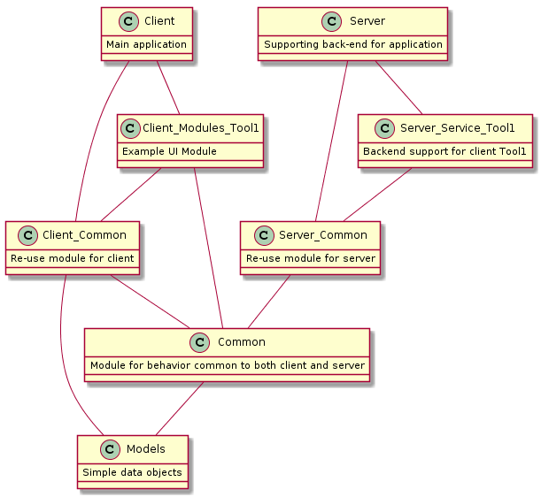

# Dotnet Core Desktop Application Template

This repository is intended to be used as a template for new dotnet core desktop applications using the `Kelson.Common` and `Ooorm.Data` packages.

## Overview

This template includes a pre-configured project layout for a client-server windows application

 * WPF Core 3.0 front end with `Kelson.Common.Wpf` MVVM framework
    * Module support
    * Runtime theming (Future: runtime localization)
    * Component communication with `Kelson.Common.Events` package
    * Strong async/await support with `Kelson.Common.Async` 
 * Asp.Net core backend
    * Data persistence abstraction with `Ooorm.Data`
    * It's asp.net `¯\_(ツ)_/¯`
 
## Structure

Multiple distinct modules exist in this solution to allow code to be shared within reasonable scopes. Generic behavior may exist in the root `Common` project, but code that is specific to either the server or client should exist in the respective `Server.Common` or `Client.Common` project. `Modules` client-side and `Services` server-side can reference projects down the dependency chain for shared behavior and interfaces.

 1. `Application.Models`
    | Should contain only POCOs (Plain-old-CLR-objects) for representing models in the application domain
    * Dependencies:
 1. `Application.Common`
    | For code shared between both client and server code
    * Project Dependencies:
        * `Application.Models`
 1. `Application.Client.Common` 
    | For non-UI focused code required by the desktop client and its modules
    * Project Dependencies:
        * `Application.Common`
        * `Applications.Models`
 1. `Application.Modules.Tool1`
    | Example UI module intended to be replaced
    * Project Dependencies:
        * `Application.Client.Common`
        * `Application.Common`
        * `Applications.Models`
    * Packages:
        * `Kelson.Common.Events`
        * `Kelson.Common.Async`
        * `Kelson.Common.Wpf`
 1. `Application.Server.Common`
    | For code common to multiple server modules/components
    * Project Dependencies:
        * `Application.Common`
        * `Application.Models`
 1. `Application.Client`
    | Contains the core desktop client application code
    * Project Dependencies:
        * `Application.Modules.Tool1`
        * `Application.Client.Common`
        * `Application.Common`
        * `Applications.Models`
    * Packages:        
        * `Kelson.Common.Events`
        * `Kelson.Common.Async`
        * `Kelson.Common.Wpf`        
 1. `Application.Server`
    | Contains the backend support code for the application
    * Project Dependencies:
        * `Application.Server.Common`
        * `Application.Common`
        * `Applications.Models`
    * Packages:
        * `Ooorm.Data.SqlServer`        
    
## Building

 * Install dotnet core 3.0 preview
 * Optionally install docker for `Application.Server` docker support
 * Optionally install dotnet-warp for executable bundeling 
    * `dotnet tool install --global dotnet-warp --version 1.0.9`